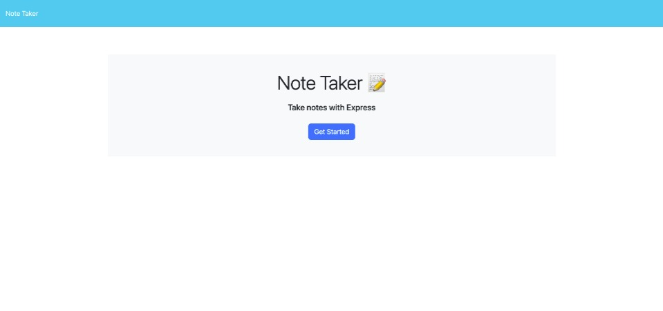
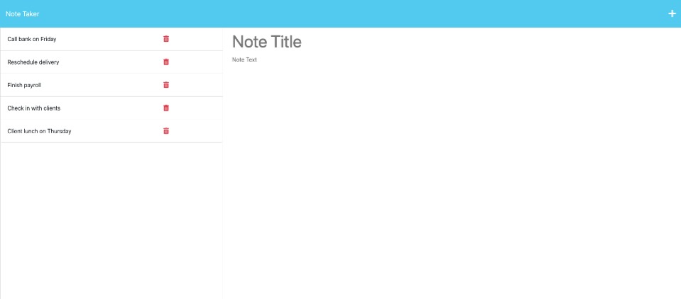
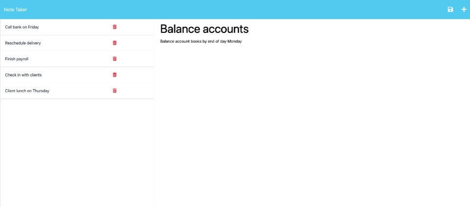

# Express-Note-Taker

## Description

This application writes and saves notes, has an Express.js back end, and saves and retrieves note data from a JSON file.

## Table of Contents

&bull; [Installation](#installation) 
&bull; [Usage](#usage) 
&bull; [License](#license) 
&bull; [How to Contribute](#how-to-contribute) 
&bull; [Tests](#tests) 
&bull; [Questions](#questions)

## Installation

[Node.js](https://nodejs.org/en/) and [Express.js](https://expressjs.com/) are required for this application. 

## Usage

Click on the "Get Started" button to begin. Enter a note title and note text, and click the "save" icon to save your note. You may delete notes by clicking the "red trash can" icon.

## License

Copyright © 2022, Michael Bartnett. Distributed under the [MIT](https://opensource.org/licenses/MIT) License.

## How to Contribute

If you have a suggestion that would make this application better, please fork the repo and create a pull request.

## Tests

After installing [Node.js](https://nodejs.org/en/) and [Express.js](https://expressjs.com/), test the application by typing "npm  start" in the command line while in the root directory. Once you receive the message "app listening at http://localhost:3001 🚀", type "http://localhost:3001" into your browser's address bar to access the application.

## Questions

Contact: mbartnett@gmail.com, [github.com/mbartnett](https://github.com/mbartnett)    